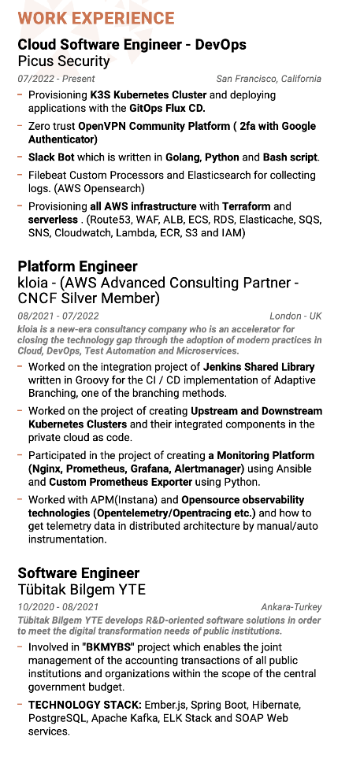
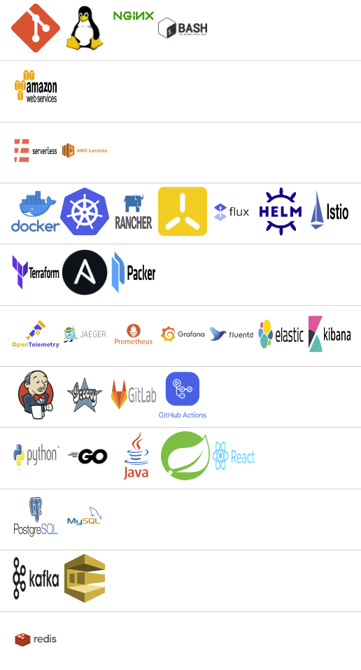

<h2>👨‍💻 Whoami </h2>

<ul>
  <li>
    <samp>
    Improving myself about <b>AWS</b>, <b>Golang</b>, <b>Kubernetes</b>, <b>Cloud Native Technologies</b> and <b>Observability</b> Stack. 
    </samp>
  </li>
 </ul>

 <h2>📫 How to reach me:</h2>

 
 

    
        
    
    
         
    
 

 

<h2 align="left"> <a href="https://www.credly.com/users/muhammed-said-kaya/badges" style="text-decoration:none;color:black">🎖 Certificates</a></h2>

 
 

<h2 align="left"> <a href="https://medium.com/@muhammedsaidkaya" style="text-decoration:none;color:black" >🖌 Latest Blog Post</a></h2>

<!-- BLOG-POST-LIST:START -->
- [OpenVPN Community Server with 2FA Google Authenticator on AWS EC2](https://medium.com/picus-security-engineering/openvpn-community-server-with-2fa-google-authenticator-on-aws-ec2-275f2e0722a6?source=rss-bb6d038e35e3------2)
- [Testing Production-Ready Applications on the Local Kubernetes Environment](https://medium.com/@muhammedsaidkaya/testing-of-production-ready-applications-on-the-local-kubernetes-environment-b1b0efc67b95?source=rss-bb6d038e35e3------2)
- [Adding Custom Metadata While Sending Logs with Filebeat](https://medium.com/picus-security-engineering/adding-custom-metadata-while-sending-logs-with-filebeat-ee72815bb34e?source=rss-bb6d038e35e3------2)
- [How to Use Git Hooks for Shift Left on Continuous Integration](https://blog.kloia.com/how-to-use-git-hooks-for-shift-left-on-continuous-integration-67c6883b6ceb?source=rss-bb6d038e35e3------2)
- [Creating Prometheus Custom Exporters with kloia_exporter Pip Package](https://blog.kloia.com/creating-prometheus-custom-exporters-with-kloia-exporter-pip-package-97a22e3aa999?source=rss-bb6d038e35e3------2)
<!-- BLOG-POST-LIST:END -->

