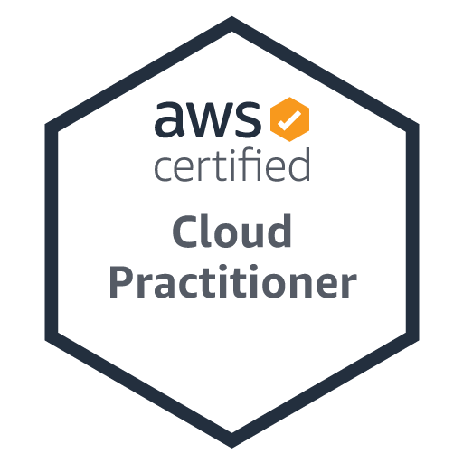
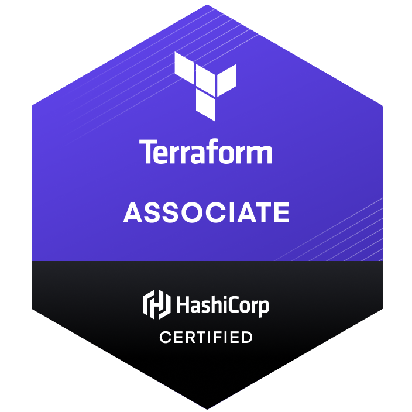

<h2>👨‍💻 Whoami </h2>

<ul>
  <li>
    <samp>
    Improving myself about <b>AWS</b>, <b>Golang</b>, <b>Kubernetes</b>, <b>Cloud Native Technologies</b> and <b>Observability</b> Stack. 
    </samp>
  </li>
 </ul>

 <h2>📫 How to reach me:</h2>

  

    <h1> 👨🏽‍💻 WORK EXPERIENCE</h1>
    <h2><b>Cloud Software Engineer - Picus Security</b></h2>
    

      <h3 style="color: gray" ;>07/2022 - Present</h3>
      <h3 style="color: gray" ;>San Francisco, California</h3>
    

    <ul style="list-style-type:none;" >
      <li>
        Provisioning <b>K3S Kubernetes Cluster</b> and deploying
applications with the <b>GitOps Flux CD.</b>
      </li>
      <li>
        Zero trust <b>OpenVPN Community Platform ( 2fa with Google
Authenticator)</b>
      </li>
      <li>
        Slack Bot which is written in <b>Golang, Python</b> and <b>Bash script.</b>
      </li>
      <li>
        Filebeat Custom Processors and Elasticsearch for collecting logs. (AWS Opensearch)
      </li>
      <li>
        Provisioning <b>all AWS infrastructure</b> with <b>Terraform</b> and <b>serverless</b> . (Route53, WAF, ALB, ECS, RDS, Elasticache, SQS, SNS, Cloudwatch, Lambda, ECR, S3 and IAM)
      </li>
       
    </ul>
    <h2><b>Platform Engineer - kloia</b></h2>
    

      <h3 style="color: gray" ;>08/2021 - 07/2022</h3>
      <h3 style="color: gray" ;>London - UK</h3>
    

    <h4 style="color: gray" ;>
      <i
        >kloia is a new-era consultancy company who is an accelerator for closing the technology gap through the adoption of modern practices in Cloud, DevOps, Test Automation and Microservices.</i
      >
    </h4>
    <ul style="list-style-type:none;">
      <li>
        Worked on the integration project of <b>Jenkins Shared Library</b> written in Groovy for the CI / CD implementation of Adaptive Branching, one of the branching methods.
      </li>
      <li>
        Worked on the project of creating <b>Upstream and Downstream Kubernetes Clusters</b> and their integrated components in the private cloud as code.
      </li>
      <li>
        Participated in the project of creating <b>a Monitoring Platform (Nginx, Prometheus, Grafana, Alertmanager)</b> using Ansible and <b>Custom Prometheus Exporter</b> using Python.
      </li>
      <li>
        Worked with APM(Instana) and <b>Opensource observability technologies (Opentelemetry/Opentracing etc.)</b> and how to get telemetry data in distributed architecture by manual/auto instrumentation.
      </li>
       
    </ul>
    <h2><b>Software Engineer - Tübitak Bilgem YTE</b></h2>
    

      <h3 style="color: gray" ;>10/2020 - 08/2021</h3>
      <h3 style="color: gray" ;>Ankara - Turkey</h3>
    

    <h4 style="color: gray" ;>
      <i
        >Tübitak Bilgem YTE develops R&D-oriented software solutions in order
to meet the digital transformation needs of public institutions.</i
      >
    </h4>
    <ul style="list-style-type:none;">
      <li>
        Involved in <b>"BKMYBS"</b> project which enables the joint management of the accounting transactions of all public institutions and organizations within the scope of the central government budget.
      </li>
      <li>
        <b>TECHNOLOGY STACK:</b> Ember.js, Spring Boot, Hibernate, PostgreSQL, Apache Kafka, ELK Stack and SOAP Web services.
      </li>
    </ul>
  

  

    <h2>💻 Tech Stack</h2>
    <table>
      <tr>
        <td>Core Technologies</td>
        <td>
          
        </td>
      </tr>
      <tr>
        <td>Cloud Provider</td>
        <td>
          
        </td>
      </tr>
      <tr>
        <td>Serverless</td>
        <td>
          
        </td>
      </tr>
      <tr>
        <td>Cloud Native Technologies</td>
        <td>
          
        </td>
      </tr>
      <tr>
        <td>Infrastructure as Code Tools</td>
        <td>
            
        </td>
      </tr>
      <tr>
        <td>Observability & Monitoring</td>
        <td>
            
        </td>
      </tr>
      <tr>
        <td>CI/CD</td>
        <td>
            
        </td>
      </tr>
      <tr>
        <td>PL/Library & Frameworks</td>
        <td>
            
        
        </td>
      </tr>
      <tr>
        <td>Databases</td>
        <td>
            
        </td>
      </tr>
      <tr>
        <td>Event Streaming Platform</td>
        <td>
            
        </td>
      </tr>
      <tr>
        <td>Caching</td>
        <td>
            
        </td>
      </tr>
    </table>
  

<h2 align="left"> <a href="https://www.credly.com/users/muhammed-said-kaya/badges" style="text-decoration:none;color:black">🎖 Certificates</a></h2>

 
 

<h2 align="left"> <a href="https://medium.com/@muhammedsaidkaya" style="text-decoration:none;color:black" >🖌 Latest Blog Post</a></h2>

<!-- BLOG-POST-LIST:START -->
- [OpenVPN Community Server with 2FA Google Authenticator on AWS EC2](https://medium.com/picus-security-engineering/openvpn-community-server-with-2fa-google-authenticator-on-aws-ec2-275f2e0722a6?source=rss-bb6d038e35e3------2)
- [Testing Production-Ready Applications on the Local Kubernetes Environment](https://medium.com/@muhammedsaidkaya/testing-of-production-ready-applications-on-the-local-kubernetes-environment-b1b0efc67b95?source=rss-bb6d038e35e3------2)
- [Adding Custom Metadata While Sending Logs with Filebeat](https://medium.com/picus-security-engineering/adding-custom-metadata-while-sending-logs-with-filebeat-ee72815bb34e?source=rss-bb6d038e35e3------2)
- [How to Use Git Hooks for Shift Left on Continuous Integration](https://blog.kloia.com/how-to-use-git-hooks-for-shift-left-on-continuous-integration-67c6883b6ceb?source=rss-bb6d038e35e3------2)
- [Creating Prometheus Custom Exporters with kloia_exporter Pip Package](https://blog.kloia.com/creating-prometheus-custom-exporters-with-kloia-exporter-pip-package-97a22e3aa999?source=rss-bb6d038e35e3------2)
<!-- BLOG-POST-LIST:END -->

