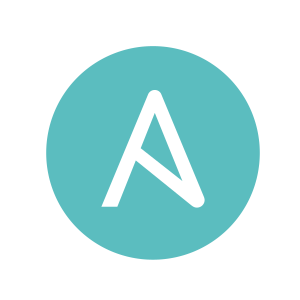

<h2>👨‍💻 Whoami </h2>

<ul>
  <li>
    <samp>
    Who willing to learn new things, constantly wants to improve himself and enjoys sharing knowledge. 
    </samp>
  </li>
   
  <li>
  <b>Experience</b>
    <ul>
      <li>
        <samp>
        Worked for <b><a href="https://yte.bilgem.tubitak.gov.tr/">Tübitak Bilgem YTE</a></b>  as <b>Software Engineer</b> over 1 year. Involved in BKMYBS project which enables the joint management of the accounting transactions of all public institutions and organizations within the scope of the central government budget. <b>Technology stack</b> is Ember.js, Spring Boot, Hibernate, PostgreSQL, Apache Kafka, ELK Stack and SOAP Web Services. (Microservice Architecture)
        </samp>
      </li>
       
      <li>
        <samp>
        Currently working as <b>Platform Engineer</b> at <b><a href="https://www.kloia.com/">kloia</a></b>. Have been involved in Observability & Platform Development & Pipeline Projects.
        </samp>
      </li>
    </ul>
  </li>
   
  <li>
    <b>Interests</b>
    <ul>
      <li>
        <samp>
        Main areas of interest are to specialize in distributed and high-available architectures and to develop platforms, automation codes, libraries be used by any product team.
        </samp>
      </li>
       
      <li>
        <samp>
        Goal is improving himself about Golang, Kubernetes, AWS and Observability Stack.
        </samp>
      </li>
    </ul>
  </li>
</ul>

<h2>📫 How to reach me:</h2>

<h2 align="left"> <a href="https://www.credly.com/users/muhammed-said-kaya/badges" style="text-decoration:none;color:black">Certificates</a></h2>

 
 

<h2 align="left"> <a href="https://medium.com/@muhammedsaidkaya" style="text-decoration:none;color:black" >🖌 Latest Blog Post</a></h2>

 <!-- 

 <a href="https://medium.com/@muhammedsaidkaya" style="padding-left:10px"> -->

<!-- BLOG-POST-LIST:START -->
- [How to Use Git Hooks for Shift Left on Continuous Integration](https://blog.kloia.com/how-to-use-git-hooks-for-shift-left-on-continuous-integration-67c6883b6ceb?source=rss-bb6d038e35e3------2)
- [Creating Prometheus Custom Exporters with kloia_exporter Pip Package](https://blog.kloia.com/creating-prometheus-custom-exporters-with-kloia-exporter-pip-package-97a22e3aa999?source=rss-bb6d038e35e3------2)
<!-- BLOG-POST-LIST:END -->

<h2 align="left"> ⚡ Recent Activity</h2>

<!--RECENT_ACTIVITY:start-->
1. 📔 Created new repository [muhammedsaidkaya/spring-opentrace-opentelemetry](https://github.com/muhammedsaidkaya/spring-opentrace-opentelemetry)
2. 📔 Created new repository [muhammedsaidkaya/ansible-collection-test](https://github.com/muhammedsaidkaya/ansible-collection-test)
3. 📔 Created new repository [muhammedsaidkaya/chart-museum-test](https://github.com/muhammedsaidkaya/chart-museum-test)
4. 📔 Created new repository [muhammedsaidkaya/ansible--molecule-example](https://github.com/muhammedsaidkaya/ansible--molecule-example)
5. 📔 Created new repository [muhammedsaidkaya/mutating-webhook-golang](https://github.com/muhammedsaidkaya/mutating-webhook-golang)
<!--RECENT_ACTIVITY:end-->

<!--RECENT_ACTIVITY:last_update-->
Last Updated: Monday, March 28th, 2022, 12:56:45 PM
<!--RECENT_ACTIVITY:last_update_end-->

<h2 align="left"> 📈  Github Stats</h2>

</img>

<h2 align="left"> 💻 Tech Stack</h2>

<!--
**muhammedsaidkaya/muhammedsaidkaya** is a ✨ _special_ ✨ repository because its `README.md` (this file) appears on your GitHub profile.

Here are some ideas to get you started:

- 🔭 I’m currently working on ...
- 🌱 I’m currently learning ...
- 👯 I’m looking to collaborate on ...
- 🤔 I’m looking for help with ...
- 💬 Ask me about ...
- 📫 How to reach me: ...
- 😄 Pronouns: ...
- ⚡ Fun fact: ...
-->
