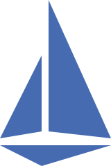

<html lang="en">
<head>
    <meta charset="UTF-8">
    <link href="https://cdn.jsdelivr.net/npm/bootstrap@5.1.3/dist/css/bootstrap.min.css" rel="stylesheet" integrity="sha384-1BmE4kWBq78iYhFldvKuhfTAU6auU8tT94WrHftjDbrCEXSU1oBoqyl2QvZ6jIW3" crossorigin="anonymous">
</head>

<h2>👨‍💻 Whoami </h2>

  <samp>
Hello, I'm Muhammed Said Kaya, working as Platform Engineer at <a href="https://www.kloia.com/">kloia</a>. I am trying to be Agile for edge technologies.
  </samp>
   
   

<h2>📫 How to reach me:</h2>

<h2 align="left"> 💻 Tech Stack</h2>

 

- **🌱 I’m currently learning ...**

<h2 align="left"> <a href="https://www.credly.com/users/muhammed-said-kaya/badges" style="text-decoration:none;color:black">Certificates</a></h2>

 
 

<h2 align="left"> <a href="https://medium.com/@muhammedsaidkaya" style="text-decoration:none;color:black" >🖌 Latest Blog Post</a></h2>

 <!-- 

 <a href="https://medium.com/@muhammedsaidkaya" style="padding-left:10px"> -->

<!-- BLOG-POST-LIST:START -->
- [Creating Prometheus Custom Exporters with kloia_exporter Pip Package](https://blog.kloia.com/creating-prometheus-custom-exporters-with-kloia-exporter-pip-package-97a22e3aa999?source=rss-bb6d038e35e3------2)
<!-- BLOG-POST-LIST:END -->

<h2 align="left"> ⚡ Recent Activity</h2>

<!--START_SECTION:activity-->
1. 🎉 Merged PR [#1](https://github.com/muhammedsaidkaya/pulumi-golang-vpc-ec2/pull/1) in [muhammedsaidkaya/pulumi-golang-vpc-ec2](https://github.com/muhammedsaidkaya/pulumi-golang-vpc-ec2)
2. 💪 Opened PR [#1](https://github.com/muhammedsaidkaya/pulumi-golang-vpc-ec2/pull/1) in [muhammedsaidkaya/pulumi-golang-vpc-ec2](https://github.com/muhammedsaidkaya/pulumi-golang-vpc-ec2)
3. ❗️ Opened issue [#7](https://github.com/kloia/prometheus-custom-exporter/issues/7) in [kloia/prometheus-custom-exporter](https://github.com/kloia/prometheus-custom-exporter)
4. 🎉 Merged PR [#6](https://github.com/kloia/prometheus-custom-exporter/pull/6) in [kloia/prometheus-custom-exporter](https://github.com/kloia/prometheus-custom-exporter)
5. 💪 Opened PR [#6](https://github.com/kloia/prometheus-custom-exporter/pull/6) in [kloia/prometheus-custom-exporter](https://github.com/kloia/prometheus-custom-exporter)
<!--END_SECTION:activity-->

<h2 align="left"> 📈  Github Stats</h2>

  

    
  

  

    </img>
  

<!--
**muhammedsaidkaya/muhammedsaidkaya** is a ✨ _special_ ✨ repository because its `README.md` (this file) appears on your GitHub profile.

Here are some ideas to get you started:

- 🔭 I’m currently working on ...
- 🌱 I’m currently learning ...
- 👯 I’m looking to collaborate on ...
- 🤔 I’m looking for help with ...
- 💬 Ask me about ...
- 📫 How to reach me: ...
- 😄 Pronouns: ...
- ⚡ Fun fact: ...
-->
